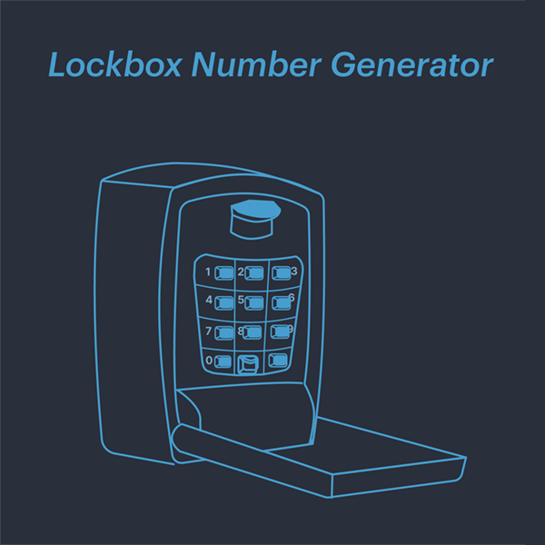

Do you need to generate a four digit code for your lock?
Are you rotating these numbers often and don't want to repeat the same numbers?




# Lockbox Number Generator

CLI tool that generates unique 4-digit numbers where each digit appears only once.

## Features
- Generate unique 4-digit numbers
- Track generated numbers to avoid duplicates
- Blacklist specific numbers
- View last generated number
- Display table of all generated numbers

## Installation

```bash
# Create virtual environment
uv venv

# Activate virtual environment
source .venv/bin/activate  # Unix
.venv\Scripts\activate     # Windows

# Install dependencies
uv pip install -e ".[dev]"  # Include dev dependencies for testing
# or
uv pip install .           # Production only
```

## Usage

```bash
# Generate new number
python main.py -g
python main.py --generate

# View last generated number
python main.py

# Blacklist a number
python main.py -b 1234
python main.py --blacklist 1234

# Show all generated numbers and their creation dates
python main.py -s
python main.py --show

```

## Development

Run tests:
```bash
pytest
```

## Project Structure
```
number_generator/
├── main.py               # Main application
├── pyproject.toml       # Project configuration
├── generated_numbers.json # Storage file (auto-generated)
└── tests/
    └── test_generator.py # Test suite
```